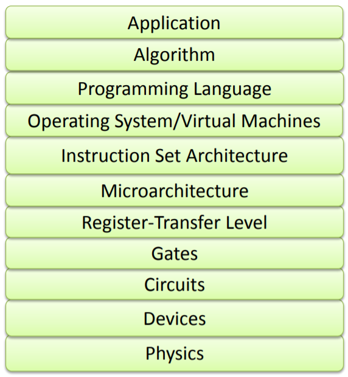

# **CSCI 311**

Computer Architecture

---

# Course Motivation

- Why do You choose this course ?

---

# Course Motivation

- How computer works ? Really curious :hushed:

--- 

# Course Motivation 

`Princeton University screenshot`

---

# For more Motivation ...

Know the history of the computers through amazing playlist

https://www.youtube.com/playlist?list=PLH2l6uzC4UEW0s7-KewFLBC1D0l6XRfye .
